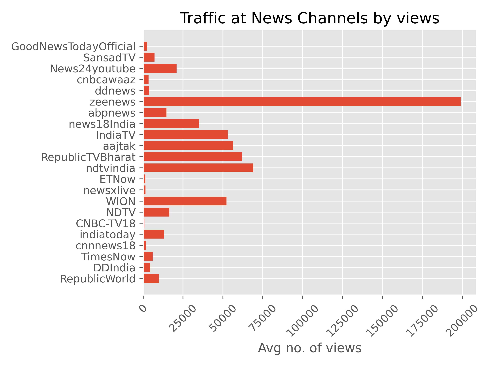

# Media Content Diversity Analysis

## Aim

This project aims to analyse various news media outlets by the content they put out, focusing specifically on the diversity in their content. For this, the judgements will be made based on internal diversity as well as diversity with respect to different news channels. At the end of this project, we hope to categorise different news channels in a systematic, algorithmic and concrete manner.

## Scope

For the purposes of this project, we've chosen to analyse 3 months of data of the top 5 english and hindi news channels in India. The data has been scraped from the youtube channels of these media outlets. This is quite close to an accurate representation of the channels as each channel uploads 100s of videos each day. <br>

The channels that we have considered for our study are,
- __English channels__
    - RepublicWorld
    - DDIndia
    - TimesNow
    - cnnnews18
    - indiatoday
- __Hindi channels__
    - RepublicTVBharat
    - aajtak
    - IndiaTV
    - news18India
    - abpnews

## Setting up the pipeline
In order to set up the pipeline on a new server/machine, the following needs to be ensured.

1. You should create a virtual environment. The required packages are listed in `requirements.txt`. Use Python version >= 3.10.

2. Install the english language data required by nltk library. You can do this via
```python
import nltk; nltk.download()
```

3. To run a cronjob that scrapes data from youtube every week and processes it. The cronjob runs the underlying `pipeline.py` file, which has a timeframe specified into it. Modify the timeframe and your cronjob schedule accordingly. (i.e. you want to pull once a week or once every day etc.). Enter into bash the following command to list the cronjob, 
```bash crontab -e ```

4. You will have to download and extract the wikipedia multistream index file from the wikipedia database, and convert it to a .pkl file. Afterwards, put it in cache under the name `wiki_index.pkl`. Download the file named `enwiki-[SOME NUMBER]-pages-articles-multistream-index.txt.bz2` where [SOME NUMBER] is a numeric value from the link https://dumps.wikimedia.org/enwiki/. Extract and convert the txt file to pkl using python. A helper conversion script is provided in this directory named `convert_index.py`.

## Observations

Some of the observed statistics up until now are presented here.




## Acknowledgements
This is my (Shreyash Ravi) thesis work done under the guidance of professor Nisheeth Srivastava at the department of computer science and engineering, IIT Kanpur.
