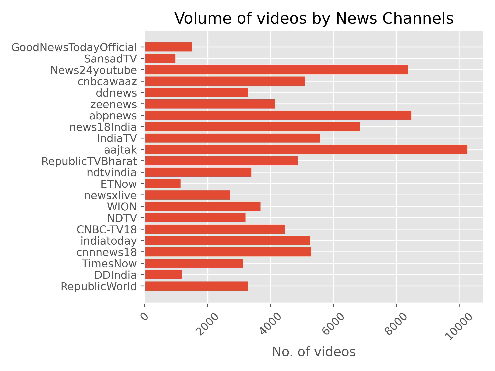

# Media Content Diversity

## Aim

This project aims to analyse various news media outlets by the content they put out, focusing specifically on the diversity in their content. For this, the judgements will be made based on internal diversity as well as diversity with respect to different news channels. At the end of this project, we hope to categorise different news channels in a systematic, algorithmic and concrete manner.

## Scope

For the purposes of this project, we've chosen to analyse 3 months of data of the top 5 english and hindi news channels in India. The data has been scraped from the youtube channels of these media outlets. This is quite close to an accurate representation of the channels as each channel uploads 100s of videos each day.  

The channels that we have considered for our study are,
- __English channels__
    - RepublicWorld
    - DDIndia
    - TimesNow
    - cnnnews18
    - indiatoday
- __Hindi channels__
    - RepublicTVBharat
    - aajtak
    - IndiaTV
    - news18India
    - abpnews

## Observations

Some of the observed statistics up until now are presented here.

## Acknowledgements
This is my (Shreyash Ravi) thesis work done under the guidance of professor Nisheeth Srivastava at the department of computer science and engineering, IIT Kanpur.
